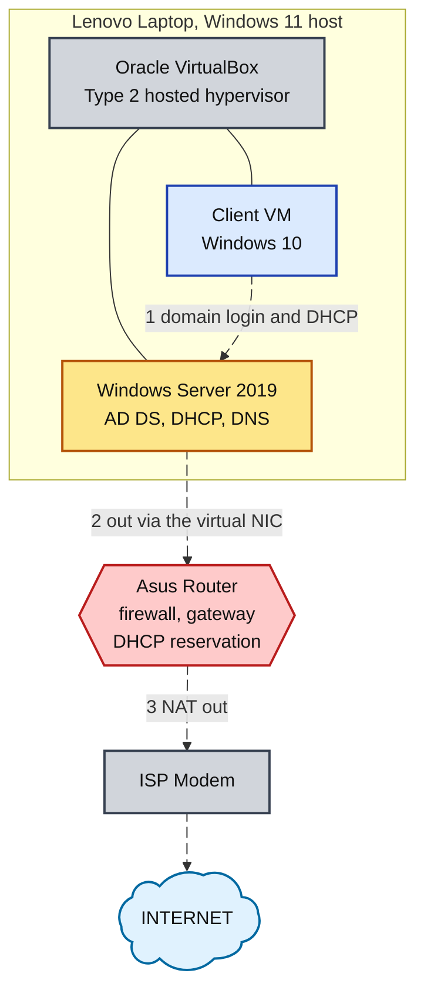
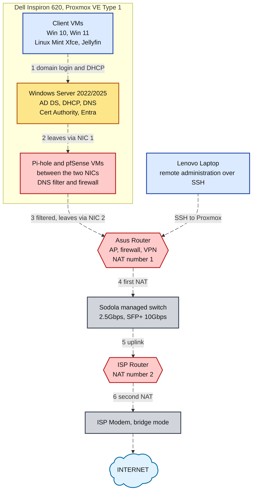

# Active Directory Lab

## Overview

Windows Server domain builds on three setups, each with different hardware, software and network boundaries.

The lab validates one chain end to end. A client powers on, leases an address, resolves the domain by name, and signs a user in. That user's mapped drive and desktop profile follow them to any other machine in the domain.

Every address below is a placeholder. Host numbers are kept as the lab used them. The spacing between them is part of the design.

## The Three Builds

| Build | Hypervisor | Server | Clients | Change from the previous build |
| --- | --- | --- | --- | --- |
| 1 | VirtualBox, Type 2 hosted, on a Lenovo laptop | Windows Server 2019 | Windows 10 | First build. All VMs ran inside VirtualBox on one laptop |
| 2 | Proxmox VE, Type 1 bare metal, on the Dell | Windows Server 2022 | Win 10, Win 11, Linux Mint Xfce | Lab moved to a dedicated server running a Type 1 bare-metal hypervisor. The laptop is now used for remote administration |
| 3 | Proxmox VE, Type 1 bare metal, on the Dell | Windows Server 2022/2025 | Win 10, Win 11, Linux Mint Xfce, Jellyfin | Second NIC added, with Pi-hole and pfSense running between the two ports, plus a managed switch |

Gateway placement is the largest difference between the three builds.

| Build | Gateway | Boundary                  |
| --- | --- | --- |
| 1 | The hypervisor's NAT address | A virtual NIC inside VirtualBox. No lab traffic reached a physical port |
| 2 | The Asus router | The Proxmox bridge on the Dell's single NIC |
| 3 | The ISP router, with the Asus router performing a second NAT | A pfSense VM between the Dell's two physical NICs |

## Build 1: VirtualBox on a Laptop

Windows Server 2019 with the Desktop Experience and one Windows 10 client, both on a single virtual network inside VirtualBox on a Windows 11 laptop.



### Addressing

| Address | Assignment |
| --- | --- |
| `<lab-net>.2` | Gateway. The hypervisor's NAT address |
| `<lab-net>.20` | Domain controller |
| `<lab-net>.21` to `.29` | Reserved static block |
| `<lab-net>.30` to `.254` | DHCP pool |

The gap between `.20` and `.30` is deliberate. It reserves space for fixed addresses that will never collide with a lease.

The domain controller does not route in this build. The hypervisor handles routing. The domain controller runs AD DS, DHCP and DNS only.

Plain NAT was the wrong VirtualBox mode here. It isolates each VM. The domain controller and client have to reach one another. A NAT Network fixed it. Read the gateway back with `ipconfig` on the domain controller before entering that address into the DHCP scope.

## Configuration Order

Several of these steps are difficult or impossible to reverse.

| Step | Action | Reason           |
| --- | --- | --- |
| 1 | Rename the machine and set the static address | A rename after a domain join requires leaving and rejoining the domain |
| 2 | Add AD DS and promote to a new forest | The role install alone produces no domain. Promotion is a separate action. The server restarts at the end of it |
| 3 | Configure a DNS forwarder | The domain controller points at itself for DNS. Every other machine points at the domain controller |
| 4 | Authorize DHCP and create one scope | A scope activated on a network that reaches the home LAN will disrupt the home LAN |
| 5 | Build the client and join it to the domain | The rename and the join occur in the same dialog |
| 6 | Create OUs and groups | Accounts need containers before they are created |
| 7 | Create accounts in bulk | The GUI creates one account at a time. A bulk create needs PowerShell |
| 8 | Configure home folders and roaming profiles | Both are on the Profile tab and must not point at the same share |

### The PowerShell alternative

I built the lab through the GUI. This is the command-line equivalent. Commands make scaling past one server possible.

Run elevated. Every value in angle brackets is a placeholder, and the quotes around them matter. PowerShell reads a bare `<` and `>` as redirection.

```powershell
# On the server VM, before any role is added
Rename-Computer -NewName "<dc-name>" -Restart

# If the NIC already holds a DHCP address, release it first or New-NetIPAddress
# fails with "Instance MSFT_NetIPAddress already exists"
Set-NetIPInterface -InterfaceAlias "Ethernet" -Dhcp Disabled
Remove-NetIPAddress -InterfaceAlias "Ethernet" -Confirm:$false -ErrorAction SilentlyContinue

New-NetIPAddress -InterfaceAlias "Ethernet" -IPAddress "<lab-net>.20" -PrefixLength 24 -DefaultGateway "<lab-net>.2"
Set-DnsClientServerAddress -InterfaceAlias "Ethernet" -ServerAddresses "127.0.0.1"
ipconfig /all

# Roles and promotion. Install-ADDSForest prompts for the DSRM password,
# then restarts the server on its own
Install-WindowsFeature -Name AD-Domain-Services -IncludeManagementTools
Install-ADDSForest -DomainName "<domain-fqdn>" -DomainNetbiosName "<NETBIOS>" -InstallDns

# After the restart
Add-DnsServerForwarder -IPAddress "<forwarder-ip>"

Install-WindowsFeature -Name DHCP -IncludeManagementTools
Add-DhcpServerInDC -DnsName "<dc-fqdn>" -IPAddress "<lab-net>.20"
Add-DhcpServerv4Scope -Name "<scope-name>" -StartRange "<lab-net>.30" -EndRange "<lab-net>.254" `
    -SubnetMask "255.255.255.0" -State Active
Set-DhcpServerv4OptionValue -ScopeId "<lab-net>.0" -Router "<lab-net>.2" -DnsServer "<lab-net>.20"

# Verification
Get-ADDomain
Get-DnsServerForwarder
Get-DhcpServerv4Lease -ScopeId "<lab-net>.0"
Get-ADComputer -Filter *
```

Verify any script from a stranger before running it, including this one. Confirm what each command changes and run it against a machine you can rebuild.

## Bulk User Creation

Accounts were created from a text file holding one full name per line. A PowerShell loop splits each name, builds the username from the first initial plus the surname, and calls `New-ADUser` once per line.

The script prints one line per account as it is created.

Two defects in my script, kept here because I hit both:

- One password variable shared across every account. Fine in a lab, wrong anywhere real. Production bulk creation generates one password per user and forces a change at first sign-in.

- The script would not run until I changed the execution policy. The error names a security setting. The message reads like a broken script when the script is fine.

## Build 2: Bare Metal on the Dell

The lab now runs on a dedicated server as a Type 1 bare-metal hypervisor. Proxmox VE replaced VirtualBox and Windows Server 2022 replaced 2019. The laptop is now used for remote administration over SSH.

| Change | Result |
| --- | --- |
| Type 1 hypervisor on dedicated hardware | The lab no longer shares a machine with a desktop workload |
| The Asus router is the gateway | The domain controller no longer routes. It runs AD DS, DHCP and DNS only |
| Administration over SSH | Administrative traffic and lab traffic use separate paths |

## Build 3: Filtered Perimeter

The current build. The Dell has two NICs, with Pi-hole and pfSense running as VMs between them. Client traffic is filtered before it reaches the router.



Filtering at step 3, ahead of the router, gives the lab a defined perimeter rather than a flat home network.

The server VM in Build 3 also carries Certificate Services and Entra hybrid sync, the two roles the diagram lists beyond the original three.

Steps 4 and 6 are a double NAT. The source address is rewritten twice on the way out. That breaks inbound port forwarding and anything that has to be reachable from outside. It is the first item on the list to change in this build.

## Lessons
| Lesson                            | Detail                                                                                                                                                                                       |
| --------------------------------- | -------------------------------------------------------------------------------------------------------------------------------------------------------------------------------------------- |
| Role install and promotion        | Installing the AD DS role and promoting the server are two separate actions. I installed the role and expected a domain                                                                      |
| DNS pointing                      | The domain controller points at itself for DNS. Every other machine points at the domain controller. Most "domain cannot be found" faults I hit traced back to that one rule                 |
| DHCP scope reach                  | A DHCP scope activated on a network reachable from the home LAN splits that LAN in two. Isolate first, activate second                                                                       |
| OUs against groups                | An OU and a group look like the same thing done twice. An OU decides which policy reaches a user. A group decides what a user can open. I built both because they answer different questions |
| Home folders and roaming profiles | Both are on the Profile tab. Pointing them at the same share breaks both                                                                                                                     |
| Promotion restart                 | Promotion restarts the server without warning. Nothing else should be mid-install at that point                                                                                              |
| Double NAT                        | The first thing to check when a service works on the LAN and fails from the internet                                                                                                         |
