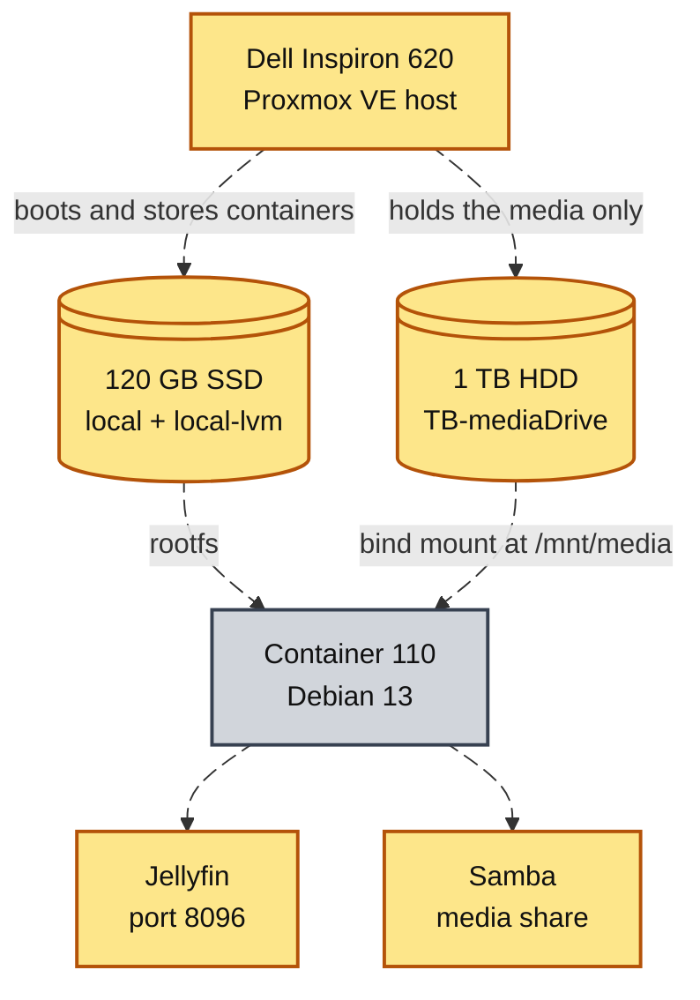

# Media Server

## Overview

Jellyfin runs in a Debian 13 LXC container on the Proxmox host and serves the media on the 1 TB drive to every screen in the house. The same container shares the drive back to Windows over Samba. Files are dragged on from a desktop.

Container 110: 2 cores, 2 GB RAM, 8 GiB root disk on the SSD, media reached at `/mnt/media`. On 2011 hardware that is enough. The library is stored in several resolutions, and the CPU only moves bytes instead of transcoding.



## Container, Not VM
A container shares the host kernel and unpacks from a template archive in seconds. A VM boots its own kernel and requires gigabytes of RAM before running any workload. On a box with a 16 GB ceiling the container was the only sensible shape.

The container was created privileged to make the disk passthrough easier on a first attempt. Privileged means root inside the container is real root on the host. A container escape is a full host compromise. On a rebuild I would make it unprivileged and map the ownership IDs. The container faces the network.

## The Mount Point Mistake

The GUI's Add Mount Point dialog takes a Storage and a size. That does not pass the drive through. It carves a fresh disk image of exactly that size out of the drive. That is how a 1 TB media drive ended up holding 8 GiB.

| Kind of mount point | Container mount         | `df -h /mnt/media` reports |
| --- | --- | --- |
| Storage-backed, the GUI default | a new volume of the typed size | about 7.8G |
| Bind mount, set from the shell | the real host directory, whole | about 916G |

```
pct set 110 -mp0 /mnt/pve/TB-mediaDrive,mp=/mnt/media
```

The failure does not announce itself. Jellyfin plays files normally and the library just stops filling at 8 GiB. `df -h` inside the container is the check that settles which kind of mount you actually have. My first build used the GUI mount and hit the cap; the bind mount is the fix, run with the container stopped.

## Install and Library

The one-line Jellyfin installer failed: the URL served an HTML page and bash tried to execute `<html>` as a command. Any `syntax error near unexpected token` right after a `curl ... | bash` means the same thing, a downloaded web page instead of a script. The fix was doing the script's four jobs by hand: fetch the signing key, write the repository file, `apt update`, `apt install jellyfin`.

The first-run wizard asks for a library folder and offers `/`. The only correct answer is a path under `/mnt/media`. Everything else lives on the 8 GiB root disk, and filling the root filesystem stops the container booting.

- Jellyfin runs as a user called `jellyfin`. Folders created as root stay owned by root. A library that adds but stays empty is an ownership problem, not a Jellyfin bug. `chown -R jellyfin:jellyfin /mnt/media` fixes it.

## Samba Share to Windows
Samba runs inside the same container and points at the same `/mnt/media`. The first share block used guest access. Windows refused it: "your organization's security policies block unauthenticated guest access". No one set that policy. Windows has blocked unauthenticated guest logons by default since version 1709, and the fix has to happen on the server.

| Setting | Guest version, refused | Password version, works |
| --- | --- | --- |
| `guest ok` | `yes` | `no` |
| `valid users` | absent | `valid users = root` |
| Samba password | none | `smbpasswd -a` run first |

A Samba password is separate from the Linux password for the same account. Setting it is the step people skip. The symptom is a credential box that keeps coming back on correct credentials.

## Lessons
| Lesson | Detail |
| --- | --- |
| Container console | The blank container Console tab is not a broken container. `pct enter 110` from the node shell is the reliable way in. It is how the whole build was done |
| Mount point timing | Add the mount point before the container's first start. A mount point added later needs a stop and start to appear |
| `force user = root` | It keeps share permissions simple and destroys any record of who wrote what. Acceptable alone at home, not a habit to carry to work |
| DHCP lease | The container leases its address by DHCP. The Windows drive mapping breaks when the lease changes. A static address or a hostname in the UNC path is the durable fix |
