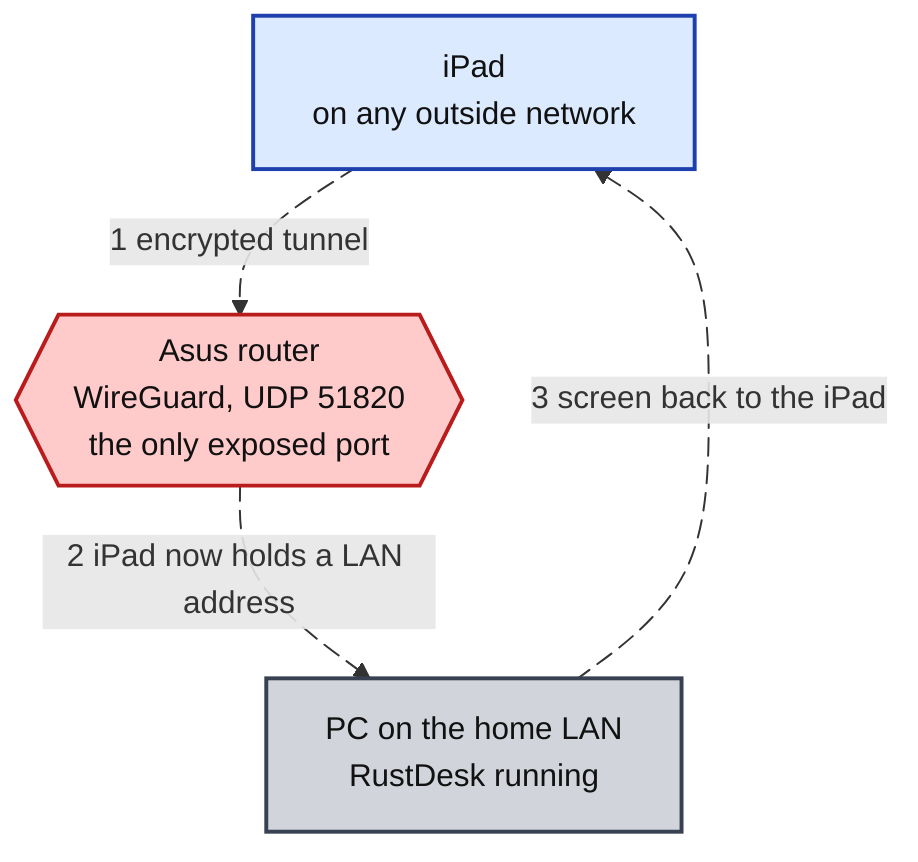
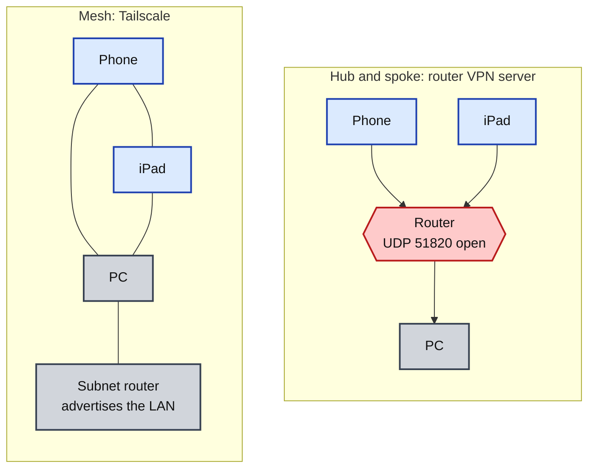
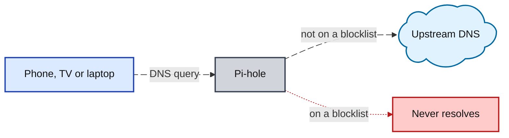
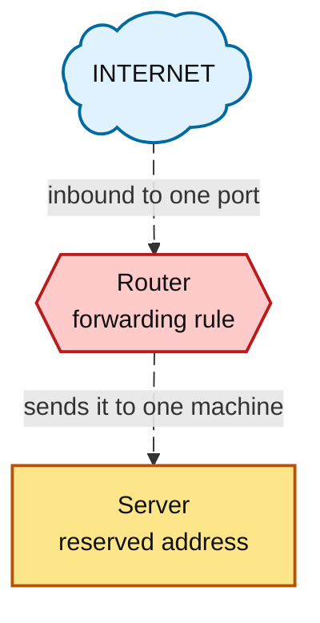

# Remote Access and Security

## Overview

Remote access to the home network and the lab, plus the filtering and hardening in front of both. A WireGuard server on the router first, then Tailscale, RustDesk over the tunnel, SSH keys held by an agent, Pi-hole for DNS, and a hardened router with an isolated guest network.

No port is forwarded at any device. One authenticated UDP port is the only thing the house exposes.

## The Remote Access Chain

Reaching a home machine from outside is two jobs, not one. The VPN gets the device onto the network. Only then does a remote desktop tool take the screen.



The diagram shows the original build, over the router's WireGuard server. Tailscale later took over the tunnel for every device, in the section below, and the order of the two jobs did not change.

Why the order matters:

| Approach | Internet exposure      |
| --- | --- |
| VPN first, then remote desktop | One UDP port that does not answer without the right key. A scanner gets silence, not a banner |
| Remote desktop exposed directly | A login page anyone scanning can find, plus every bug that service ships |
| Port forwarded straight at the PC | RDP or VNC on the public internet |

## WireGuard Server

Two iPhones reached the internet through the home router over an encrypted tunnel. Each phone was its own peer with its own key pair. Neither could touch the home LAN. This is the build that Tailscale later replaced.

| Peer setting | Value used | Effect          |
| --- | --- | --- |
| Name | One per device | Which phone a log line or a revoked key belongs to. A shared profile makes two phones look like one |
| Client IP | Router-generated `/32` | A mask covering exactly one host. The address belongs to that phone alone |
| Allowed IPs | `0.0.0.0/0` | Pushed to the phone. Sends all IPv4 traffic into the tunnel, the setting that makes a full tunnel |
| Access Intranet | Disable | Enforced on the router. Blocks the phone from reaching anything on the home LAN |

Allowed IPs and Access Intranet are two different controls on two different machines, and I mixed them up the first time. Allowed IPs decides what the phone sends. Access Intranet decides what the router lets through. Setting one does not do the other's job.

Defaults left alone on purpose:

| Setting | Left at | Reason |
| --- | --- | --- |
| Allow DNS | On | Name lookups go through the tunnel. Turning this off is a DNS leak on an untrusted network |
| Persistent keepalive | 25 seconds | Stops a cellular or cafe firewall dropping the tunnel as idle while the screen is off |
| Renew Key | Untouched | Pressing it invalidates the current pair. The phone stops connecting until its profile is deleted and the new QR code scanned |

A device that needs to drive the PC gets Access Intranet enabled. That is a per-device decision, not a global switch.

## RustDesk

RustDesk drives the home PC from an iPad once the tunnel is up. RustDesk shares the session rather than replacing it. What is on the physical monitor is what the iPad sees. Windows Remote Desktop was not an option. The server side is missing from Windows Home editions, and it logs the local user off.

RustDesk has two server pieces. `hbbs` is the ID and rendezvous server that tracks where each client currently is. `hbbr` is the relay that carries the session when the two ends cannot reach each other directly. Both can be self-hosted. Self-hosting is the reason to pick RustDesk over a commercial tool. The session never has to cross a vendor's server.

Blocking the wrong port gives two different failures. Knowing which is which saves a lot of guessing:

| Blocked | Result       |
| --- | --- |
| UDP 21116 | Clients never register at all. A machine cannot be found by its ID. They do not fall back to the relay |
| TCP 21117 | Clients still find each other. Only the sessions that needed a relay break |

With the tunnel up, both ends are on the same private network and connect directly. The relay carries nothing, no RustDesk port is forwarded, and the ID server never has to be public. A RustDesk ID and password left on defaults and reachable from the internet is a login page anyone can find. The mistake is the same as forwarding a port straight at a camera.

## Tailscale
Tailscale runs on the Lenovo laptop and is what I use to reach my own machines from outside the house. It replaced the router's WireGuard server for every device, the two phones included. The WireGuard server is retired and UDP 51820 is closed on the router. Nothing on the home network answers an unsolicited packet from the internet.

The setup also works from a mobile device. An iPad with RustDesk over Tailscale and a Bluetooth mouse and keyboard shows the home laptop's full screen. I used it to reach my home network and write better SOPs from my own documentation without carrying the laptop.

The laptop also had to be woken from outside the network for this to work at all. That meant a wake path that could be triggered remotely without leaving something exposed. I configured it and did not write down how. That one is unrecorded rather than reconstructed here.

Why I moved off the router's WireGuard server:

| Property | Router WireGuard | Tailscale |
| --- | --- | --- |
| Encryption | WireGuard | WireGuard, the same protocol |
| Inbound exposure | One open UDP port on the router | None. Devices reach out |
| Adding or removing a device | Create or delete a peer, re-scan a QR code | Sign in, or revoke in the console |
| Identity | A key pair per peer | A signed-in account per device |
| Works behind carrier-grade NAT | No. Nothing can dial in | Yes |
| Trust | Only my own router | Tailscale's coordination server, which distributes public keys and never sees a private one |

Same encryption, smaller attack surface. Nothing on the router answers from the internet. Revoking a lost device is one action instead of regenerating a peer.

Tailscale and the router's WireGuard server differ in shape, not in cipher.



Carrier-grade NAT is the case that settles it. A house with no public address of its own cannot run an inbound VPN server at all.

"Mesh" hides a fallback worth knowing about. When two devices cannot open a direct path, the traffic goes through a DERP relay instead. It stays end to end encrypted through the relay. The relay moves the packets without being able to read them. A DERP hop is slower than a direct path. The relay is the reason a connection can be fast one day and sluggish the next with nothing visibly changed.

A subnet router is one machine advertising a whole subnet. Every other device on the tailnet then reaches the printers, servers and cameras on it without any of them running a VPN client. The written design for the enterprise build puts one on its own VM:

```
sudo tailscale up --advertise-routes=<lab-subnet>/24
```

The advertised route does nothing until it is approved in the admin console. The approval step stops one machine quietly publishing a network.

Both paths are recorded here because both were built. The router's WireGuard server came first and is now retired. Tailscale carries every device, including the iPad to laptop session.

## SSH to the Proxmox Host

The laptop administers Proxmox over SSH with key authentication. The private key is attached to a KeePassXC entry. KeePassXC loads it into an SSH agent when the database is unlocked. Unlock once, and every connection after that runs with no passphrase prompt. Locking the database removes the key from the agent and closes remote access with it.

| Piece | Location       |
| --- | --- |
| Private key | Attached to a KeePassXC entry, encrypted |
| Passphrase | The entry's Password field |
| Decrypted key | In the agent, in memory, only while the database is unlocked |
| Master password | In my head |

KeePassXC supplies keys to Pageant by default, and Pageant is the PuTTY agent. PuTTY connected silently while `ssh` in PowerShell still asked for a passphrase. Pageant and the Windows ssh-agent are separate programs and do not share keys. Ticking **Use OpenSSH for Windows instead of Pageant** in the KeePassXC SSH Agent settings is what makes `ssh`, `scp` and VS Code Remote work.

Two more things that cost time on the key setup:

- Windows ships OpenSSH without `ssh-copy-id`. The public key gets appended by hand, and it has to be appended with `>>`. A single `>` wipes every other key the account trusts.

- sshd silently ignores an `authorized_keys` file that others can write to. `700` on the directory and `600` on the file, or it goes back to asking for a password with no explanation.

## DNS Filtering with Pi-hole

Pi-hole runs as a guest on the Proxmox host and answers DNS for the whole network. Blocked domains never resolve. No client software is needed on any device.



The container needs working DNS of its own before the installer runs. The install script has to resolve a domain to fetch anything.

The IPv6 catch is the one I checked this network for. If the router advertises its own IPv6 DNS server, clients often prefer that server and bypass Pi-hole entirely. The blocker looks like it stopped working. Turn off the router's IPv6 DNS advertisement, or hand out Pi-hole there too.

## Router and Guest Network Hardening

One pass through the router admin pages:

| Setting | Applied | Reason |
| --- | --- | --- |
| Admin password | Changed, stored in the password manager | The default is in every scanner's dictionary |
| Firmware | Updated, rechecked monthly | Unpatched router bugs take whole networks |
| Wi-Fi | WPA3, long passphrase | WPS-era defaults are crackable |
| WPS | Disabled | Push-button pairing is breakable |
| UPnP | Disabled | UPnP lets any device on the network silently open firewall holes. It is how cameras end up exposed |
| WAN DNS | Pointed at a filtering resolver | Blocks known-malicious domains network-wide |
| Admin page | HTTPS on the LAN only, WAN access off | HTTP sends the router password in plain text across the Wi-Fi |
| DHCP reservations | Set for servers and printers | A service is only findable at a stable address |
| Config backup | Exported after changes | A failed router costs a restore instead of a whole evening |

Two of those rows I verified against the router's own evidence rather than trusting the settings page:

- **The hardening has to be re-checked, not just set.** Reading back a saved syslog from the router later, I found `miniupnpd` running and listening for NAT-PMP on port 5351, on a router whose UPnP setting I had turned off. Either the log predates the hardening pass or the setting did not survive a firmware update. A setting is not a control until something confirms it took, and re-reading the log after a firmware update is now part of the pass.

- **The admin page certificate is the router's own.** Reading the certificate with `openssl x509` showed a root the router generated for itself, a twenty year validity, and the WAN address listed in the certificate's name list. A public certificate authority is capped at 200 days as of March 2026, and the router is bound by none of that. The certificate encrypts the session and proves nothing about who the server is. The WAN entry means the admin page is ready to serve the internet the moment WAN access is switched on. WAN access stays off.

The guest network carries more than guests. Anything that cannot be patched goes there: the television, the doorbell, the camera, the printer that stopped getting firmware years ago. A compromised smart device on the guest side cannot see the laptop or the network storage.

Two things about guest isolation that are easy to miss:

- Guest isolation is usually a separate tick box from creating the guest network. Without it, guest devices can still see each other.

- Some routers leave the admin page reachable from the guest side. Open the router's address from a guest device and confirm it does not answer.

## Port Forwarding
The lab does not use port forwarding. A forwarded service sits on the internet with nothing in front of it and gets found by scanners within hours.

Behind NAT the outside world only sees the router's public address. Nothing outside can address a machine on the LAN. A port forward is the exception carved out by hand: one incoming port mapped to one internal address and port, with everything else left unreachable.



The parts of a rule worth checking every time:

| Field | Check         |
| --- | --- |
| Protocol | Only the protocol the service uses. Leaving UDP ticked on a web server opens something for nothing |
| Destination address | Pin it with a DHCP reservation first, or the rule silently points at the wrong machine |
| External port | Does not have to match the internal port. A high external port cuts automated scanning noise |
| Internal port | The port the service actually listens on inside |

Test from the LAN first. If the internal address works and the external test then fails, the rule is the problem and not the server.

How home devices actually get compromised, and the reason this lab uses a VPN instead:

| Method | The mistake |
| --- | --- |
| Default or weak device passwords | The camera still answers to admin and 12345, and scanners try that constantly |
| Direct port forwarding | A port aimed straight at a camera or DVR puts that device's login page on the public internet |
| UPnP holes | A flawed device opens its own firewall port without you knowing |
| Stale firmware | A known bug in a device or router nobody updated |

Three of those four are settings on the router. That is why the hardening pass above exists, and why UPnP is off.

The router's own log is where the fourth shows up. Reading a saved syslog taught me which daemon owns which line: `wlceventd` for wireless clients joining and leaving, `miniupnpd` for UPnP, `acsd` for channel changes. Filtering by daemon name cuts six thousand lines down to the few hundred that matter. The disconnect lines carry a numbered reason code that separates a phone walking out of range from a wrong Wi-Fi password.

## Hardening a Lab VM

A lab VM on the home LAN needs protecting from a mistyped root command and a compromised neighbour device, not from internet scanners. Five controls cover it.

| Control | Applied with | Threat stopped |
| --- | --- | --- |
| A normal user with sudo | `adduser <name>`, then `usermod -aG sudo <name>` | A mistyped command running as root |
| Patched now | `sudo apt update && sudo apt upgrade -y` | Every already-published bug |
| Patched from now on | `sudo apt install unattended-upgrades -y` | The machine falling behind while nobody is looking |
| Default-deny firewall | `sudo ufw default deny incoming` | Every service you forgot was listening |
| Keys instead of passwords | `ssh-copy-id`, then `PasswordAuthentication no` | Password guessing from another device on the LAN |

Skipped deliberately: fail2ban, port knocking, and a non-standard SSH port. Nothing outside the house can reach these machines. A VM that is annoying to log into is a VM I stop using.

The last control is the one that locks you out. Validate the config with `sudo sshd -t` first, then confirm key login works in a second terminal before disabling password authentication. The session you are sitting in disappears at the service restart.

## Lessons
| Lesson | Detail |
| --- | --- |
| Allowed IPs and Access Intranet | Different controls on different machines. One decides what the client sends, the other decides what the router permits |
| KeePassXC and Pageant | KeePassXC supplies keys to Pageant unless told otherwise. If PuTTY connects silently and `ssh` still prompts, that is why |
| Appending a public key | Append an SSH public key with `>>`. A single `>` throws away every other key the account trusts |
| `authorized_keys` permissions | sshd ignores an `authorized_keys` file with loose permissions and says nothing about it. `700` and `600` |
| Testing a block | Test that a blocked path is actually blocked. Confirming Access Intranet works meant failing to reach the LAN on purpose, and that check is the one most people skip |
| The sshd config test | Run `sudo sshd -t` before every SSH service restart. A one-character typo in the config leaves a machine with no SSH at all |
| One change at a time | Change one setting, then test. I once changed several at once and could not locate the fault afterwards |
